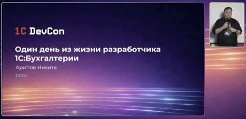
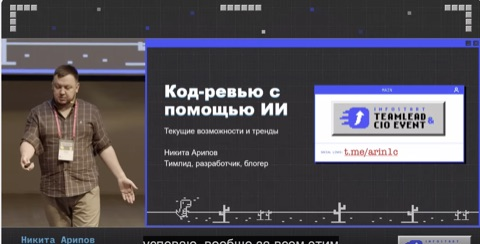
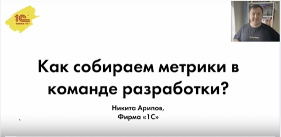

# Никита Арипов

  
  
  
  
  

## О себе

- Not looking for a job
- Слежу за тем, что происходит за пределами экосистемы 1С
- Развиваю и выпускаю 1С:Бухгалтерия некоммерческой организации
- Участвую в разработке 1С:Бухгалтерия предприятия

## Полезное

- [Тренажер: Код-ревью для 1С](https://codereview1c.ru) — практика код-ревью на реальных примерах
- [Телеграм-канал](https://t.me/+KZSbZ8N_eIA3NmQy) — про разработку в 1С
- [Стек технологий для 1С](https://github.com/Oxotka/StackTechnologies1C)
- [Дизайн-гайд для создания форм на 1С](https://github.com/Oxotka/1CDesignGuide)
- [Шаблоны новых объектов 1С для 1С:Бухгалтерия предприятия](https://github.com/Oxotka/TemplatesNewObject1C)

## Стек

 

 

 

## Выступления на конференциях

<table>
  <tr>
    <td width="25%" valign="top" align="center">
       
      <b>1C:DevCon · Один день из жизни разработчика 1С:Бухгалтерии</b>
    </td>
    <td width="25%" valign="top" align="center">
       
      <b>Инфостарт · Код-ревью с помощью ИИ</b>
    </td>
    <td width="25%" valign="top" align="center">
       
      <b>Инфостарт · Developer Experience: убираем ерунду из процесса разработки</b>
    </td>
    <td width="25%" valign="top" align="center">
       
      <b>Инфостарт · Инструменты и процессы разработки 1С:Бухгалтерии</b>
    </td>
  </tr>
  <tr>
    <td width="25%" valign="top" align="center">
       
      <b>1C:DevCon · Как собираем метрики в команде разработки</b>
    </td>
    <td width="25%" valign="top" align="center">
       
      <b>1C:DevCon · Практика проведения Code-review</b>
    </td>
    <td width="25%" valign="top" align="center">
       
      <b>1C:DevCon · Инструменты и процессы разработки 1С:Бухгалтерии</b>
    </td>
    <td width="25%" valign="top" align="center">
       
      <b>1C:TestCon · Полезные инструменты и обработки</b>
    </td>
  </tr>
</table>

## Активность

